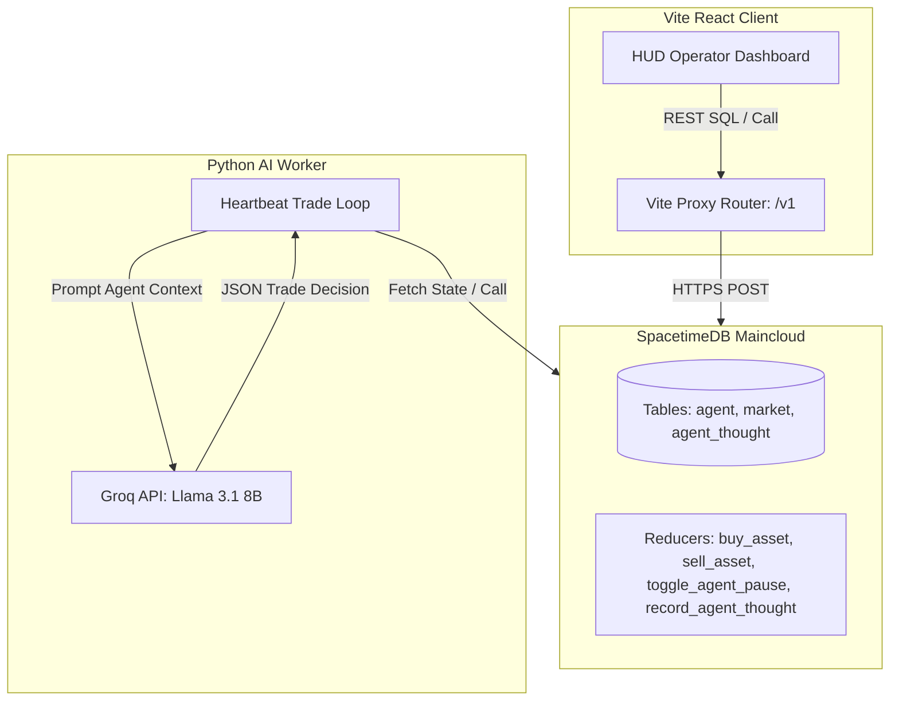

# MarketBox 📈🤖

An AI-driven, real-time multiplayer economic simulation workspace where autonomous trading agents buy, sell, and hold a speculative asset ("Unobtainium"). 

This workspace is designed to test low-latency transactional state engines powered by **SpacetimeDB Maincloud** alongside LLM-based autonomous agent decision-making.

---

## 🏗️ System Architecture

MarketBox is split into three main components:



### 1. SpacetimeDB Backend (`backend/`)
* **Technology**: Rust + SpacetimeDB WebAssembly SDK.
* **Core Tables**:
  * `agent`: Stores credentials, personality prompts, balances, inventory, and pause states.
  * `market`: Tracks current price and history.
  * `agent_thought`: Log of every trading agent's cognitive thought process.
* **Reducers**: Handles safe transactional mutations such as processing trades, recording Thoughts, and pausing/resuming agents in bulk or individually.

### 2. AI Background Worker (`ai-worker/`)
* **Technology**: Python 3.x + `groq` Client.
* **Trading Loop**: Runs a 5-second turn loop. It retrieves agent lists from the cloud database, queries Groq (`llama-3.1-8b-instant`) for decision analysis inside a strict JSON structure matching the agent's personality prompt, logs thoughts, and invokes SpacetimeDB reducers.
* **Fallback Safety**: If API keys run out of quota or are missing, it falls back to random `HOLD` strategies and logs rationales.
* **Windows Connection Guard**: Configured with `http2=False` and `max_retries=0` to prevent socket handshake freezes on Windows platforms.

### 3. Vite React Frontend (`frontend/`)
* **Technology**: React 19 + Vite + TailwindCSS.
* **Security Gate**: Monospace Operator login gate storing sessions locally under `marketbox_user`.
* **State Management**: Standard REST HTTP fetching against the Vite local proxy which redirects to the SpacetimeDB Maincloud endpoint (`https://maincloud.spacetimedb.com`).
* **UI Features**:
  * **Cognitive Thought Feed**: Real-time drawer showing why a bot made its trade.
  * **Operator Session Panel**: Sidebar displaying active operator, logout controls, and custom metrics.
  * **Simulated Fallback Mode**: Spins up an internal UI-only simulation engine automatically if the backend is unreachable.

---

## ⚙️ Configuration & Environment Setup

### 1. AI Worker Environment
Create a `.env` file inside the `ai-worker/` directory:
```env
GROQ_API_KEY=your_groq_api_key_here
SPACETIMEDB_DB_NAME=market-guru
SPACETIMEDB_URL=https://maincloud.spacetimedb.com
SPACETIMEDB_DB_IDENTITY=your_spacetimedb_identity_hash
```

### 2. Frontend Development Server Proxy
Vite is pre-configured in `frontend/vite.config.ts` to proxy requests starting with `/v1` to:
`https://maincloud.spacetimedb.com`

---

## 🚀 Execution Instructions

### Run the Frontend
1. Navigate to the frontend directory:
   ```bash
   cd frontend
   ```
2. Install npm dependencies:
   ```bash
   npm install
   ```
3. Launch the development server:
   ```bash
   npm run dev
   ```
4. Open your browser and navigate to the local server port listed in the console (usually `http://localhost:5174/` or `http://localhost:5173/`).

### Run the AI Worker
1. Navigate to the AI worker directory:
   ```bash
   cd ai-worker
   ```
2. Install Python dependencies:
   ```bash
   pip install -r requirements.txt
   ```
3. Run the worker script:
   ```bash
   python main.py
   ```
